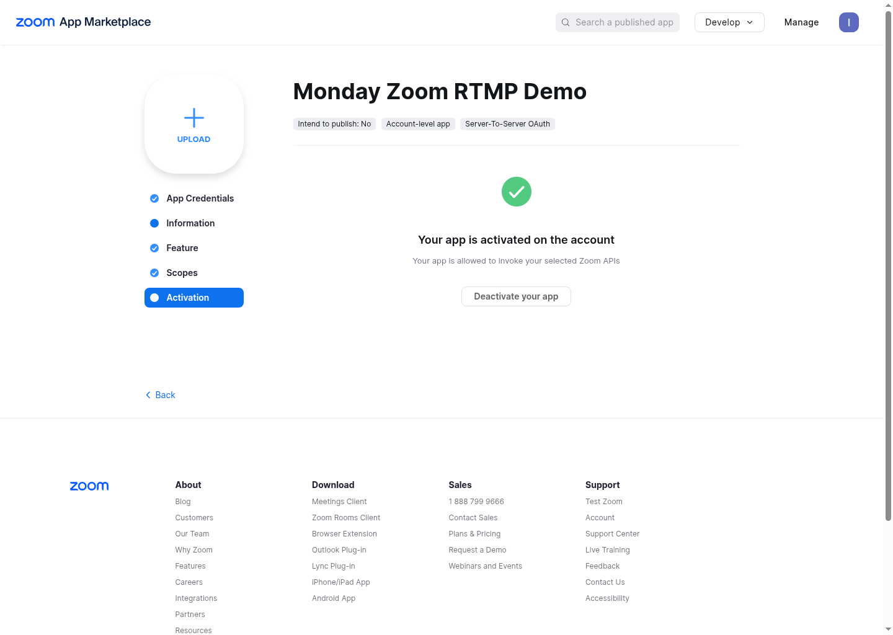
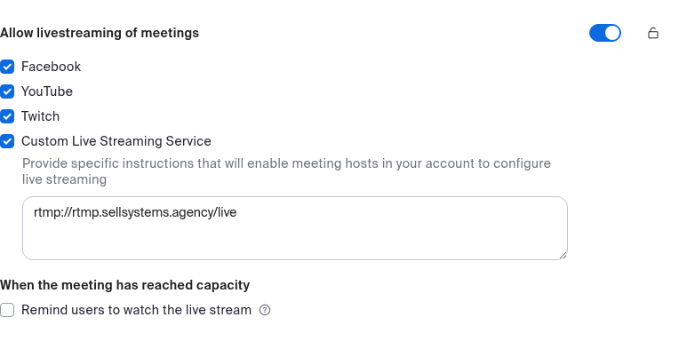
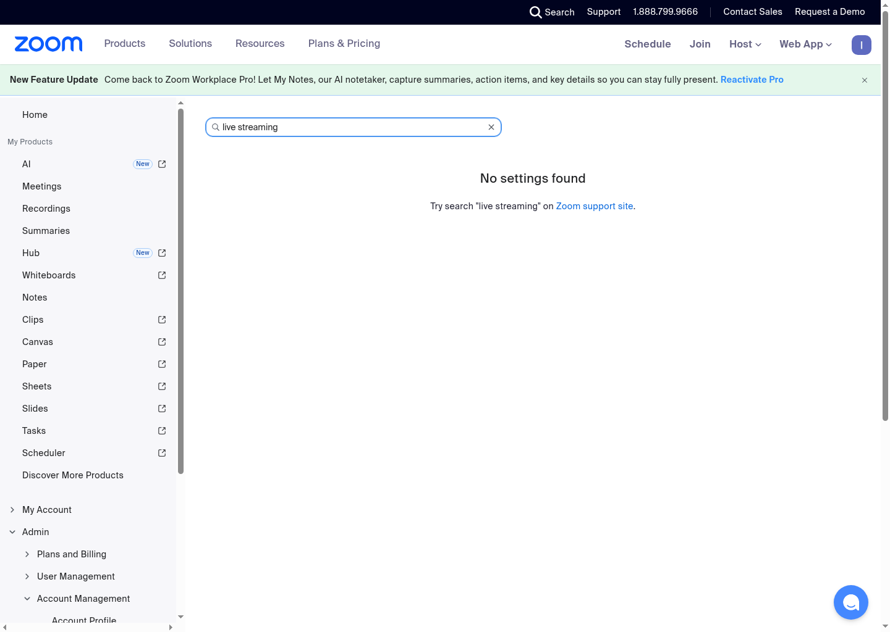

# Zoom App Setup Guide

This guide is for the clean `zoom-monday-rtmp-demo` flow.

It covers:

- creating the correct Zoom app type
- enabling the right event subscription lane
- collecting the exact values an operator or agent needs
- mapping those values into this repository

## Recommended app type

Use a single **Server-to-Server OAuth** app.

Why this is the default for this repo:

- the repo uses backend Zoom REST calls
- Zoom documents that Server-to-Server OAuth apps can also subscribe to events
  with Webhooks
- this keeps API auth and webhook auth in one app instead of splitting them
  across multiple app types

If your organization insists on a separate webhook-only app, that is still
possible, but this starter repo is documented around one Server-to-Server OAuth
app.

## Values you must collect

### API auth values

Collect these from the Zoom app:

- `ZOOM_ACCOUNT_ID`
- `ZOOM_CLIENT_ID`
- `ZOOM_CLIENT_SECRET`

The current CLI still reads a short-lived bearer token directly:

- `ZOOM_ACCESS_TOKEN`

So there are two valid handoff styles:

1. give the operator or agent the first three values and let them mint the
   access token when needed
2. mint the token yourself and provide `ZOOM_ACCESS_TOKEN`

### Webhook auth value

Collect this from the Zoom app too:

- `ZOOM_WEBHOOK_SECRET_TOKEN`

This is what the included Node-RED webhook flow uses for:

- endpoint validation (`endpoint.url_validation`)
- request signature verification (`x-zm-signature`)

### Meeting host value

You also need:

- `ZOOM_USER_ID`

Use:

- `me` if the token will act on the same Zoom user that owns the meetings
- a real Zoom user ID if you need to target a specific host user

## Step 1. Create the app

1. Open the Zoom App Marketplace developer area.
2. Choose **Develop**.
3. Choose **Build App**.
4. Choose **Server-to-Server OAuth**.
5. Create the app.

Then complete the basic metadata fields Zoom requires.

Practical recommendation:

- use an app name that describes the environment, for example
  `Zoom Monday RTMP Prod`
- keep the contact email tied to whoever can rotate scopes and credentials later

## Step 2. Add the scopes this repo actually needs

This repo currently calls these Zoom Meetings API actions:

- create a meeting
- update a meeting's custom livestream target
- start a livestream
- stop a livestream
- get livestream details

So the app needs the matching meeting scopes.

Use the scope names Zoom exposes in your account for these capabilities:

- create meeting
  - `meeting:write:meeting`
- update custom livestream settings
  - `meeting:update:livestream`
- start and stop livestream status
  - `meeting:update:livestream_status`
- read livestream details
  - `meeting:read:livestream`

Important:

- depending on account role and Zoom's current UI, you may see `:admin` or
  `:master` variants
- that is acceptable as long as the capability matches the list above

Do not add broad extra scopes unless your downstream automation truly needs
them.

## Step 3. Enable event subscriptions

Enable the webhook lane inside the same app.

Use this endpoint pattern:

- `https://your-domain.example.com/zoom/webhook`

For the current fronted single-instance pattern, the production route is:

- `https://mondayzoom.sellsystems.agency/zoom/webhook`

When Zoom validates the endpoint, it sends:

- `event = endpoint.url_validation`
- `payload.plainToken`

Your webhook handler must answer with:

- the same `plainToken`
- `encryptedToken = HMAC_SHA256(plainToken, ZOOM_WEBHOOK_SECRET_TOKEN)`

The included flow file already implements that:

- `deploy/node_red/zoom_webhook_hls_flow.json`

### Core events to subscribe to

The clean starter flow should begin with:

- `meeting.started`
- `meeting.ended`

That is enough for the core lifecycle:

- meeting begins
- meeting ends
- downstream recording finalization starts afterwards

Only add more events if your own workflow actually consumes them.

## Step 4. Activate the app

Do not skip activation.

If the app is not activated:

- token generation will fail
- event subscriptions may not deliver

Reference screenshot:



## Step 5. Confirm the Zoom host can use custom livestream

The app alone is not enough.

The target Zoom host user must also have custom livestream available in the Zoom
account policy that governs that user.

Before blaming the API, confirm:

- the host user is the one referenced by `ZOOM_USER_ID`
- that host can use custom livestream in the Zoom UI
- the account license and policy actually allow it

Practical operator note:

- if meeting creation works but `PATCH /meetings/{id}/livestream` fails with
  Zoom API `code: 3000`, the app is not the whole story
- this usually means the account setting for meeting livestreaming is unavailable,
  disabled, or locked by plan/policy
- if the Zoom web portal only shows upgrade prompts and you cannot find any
  live-stream setting in account or user meeting settings, treat that as a plan
  or policy blocker until proven otherwise

Verified account signature from the working `2026-07-02` run:

- the host profile showed `Zoom Meetings` with `100 participants`
- the account meeting settings showed `Allow livestreaming of meetings` enabled
- `Custom Live Streaming Service` was checked in the same section

Reference screenshots:




Example of the failure signature in the account settings UI:



## Step 6. Mint a short-lived access token

Zoom's Server-to-Server OAuth token request uses:

- `grant_type=account_credentials`
- your `account_id`

Example:

```bash
export ZOOM_ACCOUNT_ID='...'
export ZOOM_CLIENT_ID='...'
export ZOOM_CLIENT_SECRET='...'

BASIC_AUTH="$(printf '%s:%s' "$ZOOM_CLIENT_ID" "$ZOOM_CLIENT_SECRET" | base64 | tr -d '\n')"

curl -sS -X POST 'https://zoom.us/oauth/token' \
  -H "Authorization: Basic $BASIC_AUTH" \
  -H 'Content-Type: application/x-www-form-urlencoded' \
  -d "grant_type=account_credentials&account_id=${ZOOM_ACCOUNT_ID}"
```

From the JSON response, take:

- `access_token`

and store it as:

- `ZOOM_ACCESS_TOKEN`

Important:

- Zoom documents this token lifetime as `3600` seconds
- there is no refresh token in this flow
- agents should mint a fresh token when needed instead of committing one into
  the repo
- this repository can now mint the token automatically at runtime when
  `ZOOM_ACCOUNT_ID`, `ZOOM_CLIENT_ID`, and `ZOOM_CLIENT_SECRET` are present

## Step 7. Map the values into this repository

Minimum runtime values when you want to pass a one-off token directly:

```env
ZOOM_BASE_URL=https://api.zoom.us/v2
ZOOM_ACCESS_TOKEN=...
ZOOM_WEBHOOK_SECRET_TOKEN=...
ZOOM_USER_ID=me
RTMP_STREAM_BASE=rtmp://your-instance.example.com:49224/live
RTMP_PAGE_BASE=https://your-instance.example.com/player
```

Recommended operator or agent handoff values to keep outside Git:

```env
ZOOM_ACCOUNT_ID=...
ZOOM_CLIENT_ID=...
ZOOM_CLIENT_SECRET=...
ZOOM_BASE_URL=https://api.zoom.us/v2
ZOOM_TOKEN_URL=https://zoom.us/oauth/token
ZOOM_WEBHOOK_SECRET_TOKEN=...
ZOOM_USER_ID=me
RTMP_STREAM_BASE=rtmp://your-instance.example.com:49224/live
RTMP_PAGE_BASE=https://your-instance.example.com/player
```

When those account credentials are available, `ZOOM_ACCESS_TOKEN` is optional.
The CLI will mint a fresh token automatically before the Zoom API call.

## Step 8. Validate before real meetings

### Check public webhook reachability

Use a CRC-style test payload:

```bash
curl -i -X POST 'https://your-domain.example.com/zoom/webhook' \
  -H 'Content-Type: application/json' \
  -d '{"event":"endpoint.url_validation","payload":{"plainToken":"abc123"}}'
```

Expected behavior:

- HTTP `200`
- JSON containing:
  - `plainToken`
  - `encryptedToken`

### Check the repo can call Zoom

With a fresh `ZOOM_ACCESS_TOKEN` loaded:

```bash
python -m zoom_monday_rtmp_demo.cli zoom-create-meeting \
  --topic "Zoom API smoke test" \
  --duration 30 \
  --start-in-minutes 10
```

If that works, your app scopes and token are aligned with the repo.

### Check the Node-RED control lane

The included control flow adds these local routes:

- `POST /zoom/create-meeting`
- `POST /zoom/create-meeting-with-livestream`
- `POST /zoom/start-livestream`
- `POST /zoom/stop-livestream`
- `GET /zoom/livestream/:meetingId`

Minimal create-only smoke test:

```bash
curl -k -X POST 'https://127.0.0.1:1881/zoom/create-meeting' \
  -H 'Content-Type: application/json' \
  -d '{"topic":"Node-RED demo","duration":30,"start_in_minutes":10}'
```

Provision-with-livestream smoke test:

```bash
curl -k -X POST 'https://127.0.0.1:1881/zoom/create-meeting-with-livestream' \
  -H 'Content-Type: application/json' \
  -d '{"topic":"Node-RED livestream demo","duration":30,"start_in_minutes":10}'
```

### Check host-side meeting start before livestream start

The livestream status call only works after the meeting is actually live.

Practical verified behavior from the `2026-07-02` run:

- `zoom-start-livestream` fails with Zoom API `code: 3000` if the meeting has
  not started yet
- the standard Zoom `start_url` may first land on a success page that tries the
  desktop `zoommtg://` protocol
- for browser-hosted testing, the reliable host path was:
  - `https://app.zoom.us/wc/{meetingId}/start?zak=...`

So the operator sequence is:

1. create the meeting
2. configure the livestream target
3. start the host meeting in Zoom
4. only then call `zoom-start-livestream`

## Common failure modes

### Webhook validation returns 401 or never reaches the handler

Check:

- the route is public without Basic Auth on that specific path
- your reverse proxy forwards POST bodies unchanged
- the app is activated

### Webhook validation returns 503

Check:

- `ZOOM_WEBHOOK_SECRET_TOKEN` is loaded in the webhook runtime
- the handler is actually using the same secret token shown in the Zoom app

### Meeting creation works but livestream update fails

Check:

- the app has the livestream-related scopes
- the host user is allowed to use custom livestream
- the meeting belongs to the same user context as `ZOOM_USER_ID`
- the account plan actually exposes the live-stream setting in Zoom

### Start livestream succeeds but no media arrives

Check:

- `RTMP_STREAM_BASE` is the public address Zoom can reach
- you did not confuse the local RTMP listen port with the public published port
- your stream key matches the path the RTMP server expects

### Recording watcher waits for the wrong filename

The verified nginx RTMP output pattern is:

- `MEETINGID-TIMESTAMP.flv`

not:

- `MEETINGID.flv`

If you build downstream automation around recording pickup, do not hard-code
the bare meeting ID filename unless you also change the RTMP recording config.

### HLS was visible during live stream but gone after stop

That is expected for the current demo pattern.

During the verified run:

- `/hls/{meetingId}/index.m3u8` returned `200` while the livestream was active
- the per-meeting HLS directory was no longer present after livestream stop

So treat HLS as a live-session output, not as the durable archive artifact.

## Related repo files

- setup overview:
  - `docs/setup.md`
- fronted instance webhook + player flow:
  - `deploy/node_red/zoom_webhook_hls_flow.json`
- CLI:
  - `src/zoom_monday_rtmp_demo/cli.py`
- env example:
  - `.env.example`
